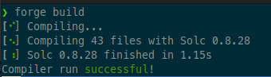
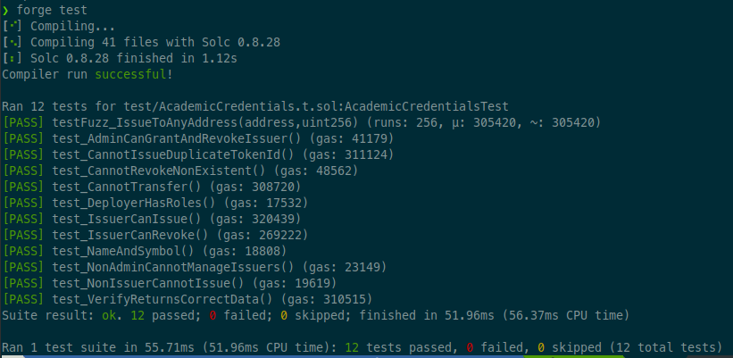

# Trabajo Final: Sistema de Emisión y Verificación de Credenciales Académicas (UNLu)

Este documento estructura los entregables del Trabajo Final de la asignatura **Desarrollo de Smart Contracts y DApps** de la **Diplomatura en Transparencia y Gestión de Credenciales Digitales: Blockchain y Gestión Académica Universitaria (UNQ)**.

---

## 1. Carátula

* **Universidad**: Universidad Nacional de Quilmes (UNQ)
* **Carrera**: Diplomatura en Transparencia y Gestión de Credenciales Digitales: Blockchain y Gestión Académica Universitaria
* **Materia**: Desarrollo de Smart Contracts y DApps
* **Año**: 2026
* **Estudiante**: Esp. Pablo Tomás Delvechio
* **Docentes**:
  * Dr. David Petrocelli
  * Esp. Ciro Edgardo Romero

---

## 2. Enlace al Código Fuente

* **Repositorio de Git**: [https://github.com/tomasdelvechio/tp-final-dapps-diplo-blockchain](https://github.com/tomasdelvechio/tp-final-dapps-diplo-blockchain)
* **Rama Principal**: `main`

---

## 3. Compilación y Eventos Emitidos

### Compilación sin Warnings

El contrato inteligente ha sido compilado utilizando **Foundry (Forge)**, con la versión del compilador fijada de forma estricta en **0.8.28** en el archivo `foundry.toml` para asegurar la máxima estabilidad frente a errores conocidos de Solidity 0.8.20. El proceso de compilación arroja cero advertencias (warnings).

> 

### Eventos del Contrato

El contrato [AcademicCredentials.sol](file:///home/tomas/workspace/diplomatura-blockchain/dApps/tp-final/unlu-cert-token/src/AcademicCredentials.sol) emite eventos en todas las operaciones que modifican el estado del contrato en la blockchain, facilitando el indexado off-chain. Los eventos implementados y sus firmas son:

1. **`CredentialIssued`**: Emitido cuando una nueva credencial académica es acuñada hacia la wallet de un estudiante.
   
   ```solidity
   event CredentialIssued(
       address indexed student,
       uint256 indexed tokenId,
       string degreeName,
       bytes32 studentNameHash
   );
   ```

2. **`CredentialRevoked`**: Emitido cuando una credencial emitida es marcada como inactiva (revocada/quemada) por un emisor autorizado.
   
   ```solidity
   event CredentialRevoked(
       uint256 indexed tokenId,
       address indexed by,
       string reason
   );
   ```

3. **`IssuerGranted`**: Emitido por el administrador del contrato (`Rectorado`) al conceder privilegios de emisión (`ISSUER_ROLE`) a una wallet académica.
   
   ```solidity
   event IssuerGranted(address indexed account, address indexed by);
   ```

4. **`IssuerRevoked`**: Emitido por el administrador al retirar los privilegios de emisión de una dirección.
   
   ```solidity
   event IssuerRevoked(address indexed account, address indexed by);
   ```

---

## 4. Auditoría de Seguridad (SECURITY.md)

El análisis de seguridad detallado y la auditoría estática con la herramienta **Slither** se encuentran documentados en el archivo [SECURITY.md](./unlu-cert-token/SECURITY.md) dentro del código fuente.

---

## 5. Pruebas Unitarias y Fuzzing

Se implementó una cobertura completa superior al **80%** en la suite de pruebas mediante el entorno de testing de Foundry (`forge test`).

### Detalle de la Batería de Pruebas

1. **`test_NameAndSymbol`**: Verifica que el ERC721 asigne correctamente el nombre y símbolo del token (`UNLu-CRED`).
2. **`test_DeployerHasRoles`**: Comprueba que el deployer adquiera por defecto los roles administrativos y de emisor.
3. **`test_AdminCanGrantAndRevokeIssuer`**: Valida que la cuenta administradora pueda asignar y revocar el rol de emisor.
4. **`test_IssuerCanIssue`** (Happy Path): Verifica la correcta emisión y almacenamiento de la estructura `Credential`.
5. **`test_VerifyReturnsCorrectData`** (Happy Path): Comprueba que la función `verify` retorne la tupla de datos y el booleano `isValid = true` correctos.
6. **`test_IssuerCanRevoke`** (Happy Path): Valida que la revocación de un título lo marque como inactivo e inválido y lo queme en la blockchain.
7. **`test_NonIssuerCannotIssue`** (Caso de Error): Verifica que una cuenta sin permisos de emisor reciba un revert al intentar emitir.
8. **`test_CannotTransfer`** (Caso de Error - Soulbound): Valida que cualquier intento de transferir un token ya acuñado entre direcciones válidas sea abortado (`revert`).
9. **`test_CannotIssueDuplicateTokenId`** (Caso de Error): Asegura que no se puedan emitir dos credenciales con el mismo identificador.
10. **`test_CannotRevokeNonExistent`** (Caso de Error): Verifica que falle el intento de revocación sobre un identificador de token inexistente.
11. **`test_NonAdminCannotManageIssuers`** (Caso de Error): Valida el revert si una cuenta no administradora intenta otorgar o revocar roles de emisor.

### Fuzz Test

* **`testFuzz_IssueToAnyAddress(address student, uint256 tokenId)`**: Prueba de fuzzing que valida la invarianza del contrato: para cualquier dirección de estudiante aleatoria (distinta de cero) y cualquier identificador numérico, la credencial se emite correctamente y el propietario asignado corresponde biunívocamente al estudiante fuzzeado.

> 

---

## 6. Contrato Desplegado en Base Sepolia

* **Red de pruebas**: Base Sepolia (Chain ID 84532)
* **Dirección del Contrato**: `0x9E32A1C171aDDa640C02Ae92398c16F31A865ca2`
* **Contrato Verificado (Basescan)**: [Ver en Basescan](https://sepolia.basescan.org/address/0x9e32a1c171adda640c02ae92398c16f31a865ca2)
* **Código de Fuente Verificado (Basescan - Solc 0.8.28)**: [Ver Código en Basescan](https://sepolia.basescan.org/address/0x9e32a1c171adda640c02ae92398c16f31a865ca2#code)

---

## 7. Credenciales Emitidas Reales (Base Sepolia)

A continuación, se listan los enlaces a las transacciones reales en Base Sepolia visibles a través del explorador Basescan:

1. **Emisión de Credencial Académica (ID: 1)**
   * **Hash de Tx**: `0xc6cb6b7e4a703ebcf859a71fe12cf83698474e9c3d8efe3fb784f62c91aa4efd`
   * **Enlace**: [Ver en Basescan](https://sepolia.basescan.org/tx/0xc6cb6b7e4a703ebcf859a71fe12cf83698474e9c3d8efe3fb784f62c91aa4efd)
2. **Emisión de Credencial Académica (ID: 2)**
   * **Hash de Tx**: `0x12c47a9292539fddf39d7542a2fe8d260311a2bec0fe6fe8c6b4da97204616e4`
   * **Enlace**: [Ver en Basescan](https://sepolia.basescan.org/tx/0x12c47a9292539fddf39d7542a2fe8d260311a2bec0fe6fe8c6b4da97204616e4)
3. **Revocación de Credencial Académica (ID: 2)**
   * **Hash de Tx**: `0xe0210e1d817b8e6cc242bd23a1a55a86b1b288e8487d4b1ab18724308c0bd496`
   * **Enlace**: [Ver en Basescan](https://sepolia.basescan.org/tx/0xe0210e1d817b8e6cc242bd23a1a55a86b1b288e8487d4b1ab18724308c0bd496)

*(Nota: En caso de requerir un enlace de emisión adicional para totalizar tres registros de acuñación activa, contactar a tdelvechio <at> unlu.edu.ar).*

---

## 8. Aplicación Web Funcionando (Frontend)

* **Enlace a la dApp Online**: [https://dapps-academic-credentials.vercel.app/](https://dapps-academic-credentials.vercel.app/)
* **Tecnologías Frontend**: Next.js 14, React, Wagmi v2, Viem v2, RainbowKit.
