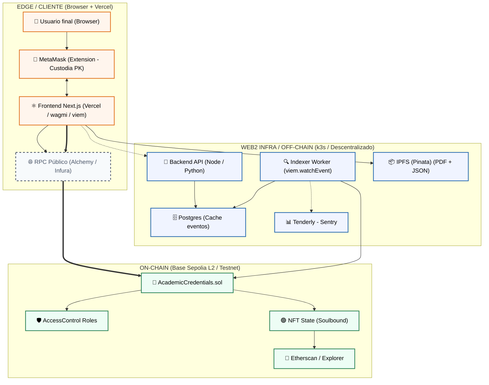
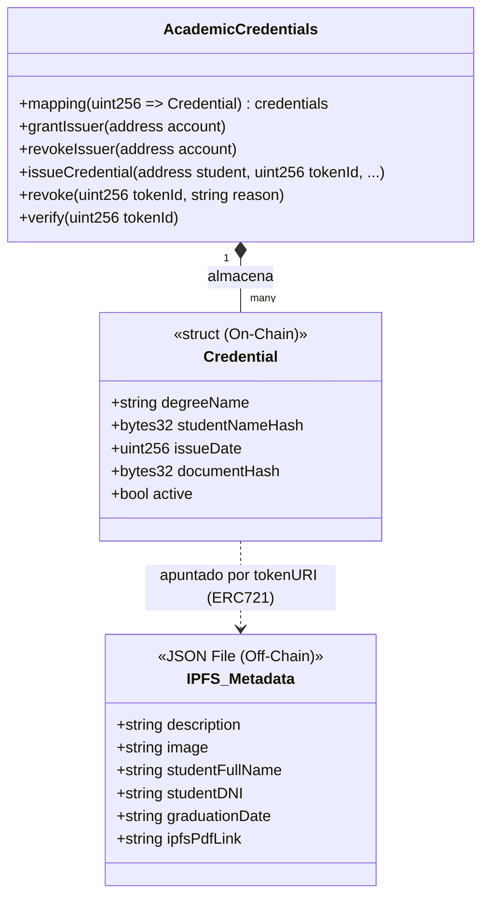
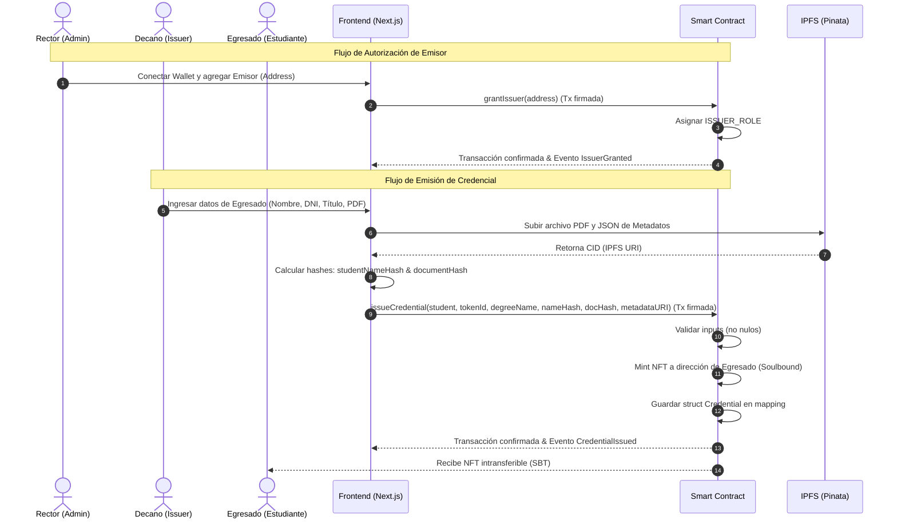
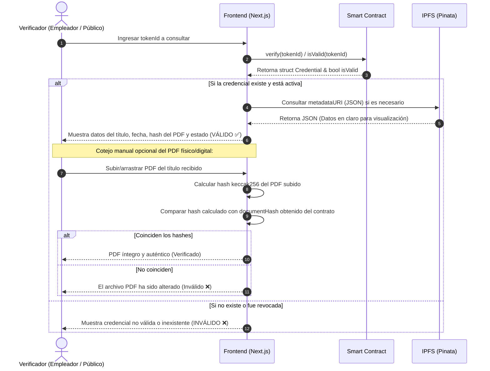

# UNLu Academic Credentials (Trabajo Final DApps)

Este repositorio es un monorepo que contiene la solución para el Trabajo Final de la asignatura dApps de la Diplomatura en Blockchain de UNQ, consistente en una aplicación descentralizada (dApp) para la emisión y verificación de credenciales académicas de la **Universidad Nacional de Luján (UNLu)** utilizando tokens "Soulbound" (NFTs ERC-721 no transferibles).

---

**Asignatura**: Desarrollo de Smart Contracts y DApps

**Carrera**: Diplomatura en Transparencia y Gestión de Credenciales Digitales: Blockchain y Gestión Académica Universitaria - UNQ

**Estudiante**: Esp. Pablo Tomás Delvechio

**Docentes**: Dr. David Petrocelli y Esp. Ciro Edgardo Romero

---

# Parte 0: Definiciones generales y modelado

## Introducción

La adopción de la tecnología blockchain como capa de infraestructura para el sistema de títulos de la Universidad Nacional de Luján (UNLu) resuelve las limitaciones de los sistemas centralizados tradicionales, garantizando la inmutabilidad, transparencia y disponibilidad permanente de las credenciales [1, 2]. Al descentralizar el estado, se mitigan vulnerabilidades críticas como la pérdida de datos en servidores locales o el fraude documental, estableciendo una defensa robusta contra alteraciones no autorizadas [1]. Esta arquitectura beneficia enormemente al egresado, otorgándole verdadera soberanía digital y control sobre su identidad, a la vez que permite a empleadores y entidades globales verificar la autenticidad de un título de manera instantánea y sin depender de la intervención manual de intermediarios administrativos [1, 2, 3].

Para sostener esta infraestructura y modelar de forma segura el flujo administrativo real de la universidad, resulta indispensable un diseño que asigne responsabilidades claras en el contrato inteligente. Por ello, se implementó un control de acceso basado en roles diferenciados mediante `AccessControl`, asignando el `DEFAULT_ADMIN_ROLE` al Rectorado para la gobernanza y el `ISSUER_ROLE` a los Decanatos o direcciones de alumnos para la emisión y revocación de títulos [2]. Esta decisión arquitectónica modularizada protege al sistema limitando el impacto ante un eventual compromiso de claves y asegura el cumplimiento estricto de las políticas institucionales de emisión [2]. La adopción de un modelo de gobernanza con roles claramente definidos, que incluye a los administradores, a las instituciones emisoras y a los verificadores públicos, es una práctica altamente recomendada para plataformas académicas descentralizadas, ya que garantiza la rendición de cuentas y la delegación segura de la autoridad certificante en la red [2].

Finalmente, para asegurar que estas credenciales emitidas cumplan con los requisitos de privacidad y exclusividad del titular, el sistema combina un modelo de datos híbrido con restricciones a nivel de token. Por un lado, los datos sensibles (como el nombre y DNI) y el PDF del título se almacenan *off-chain*, registrando únicamente sus esquemas de compromiso criptográfico (`studentNameHash`, `documentHash`) *on-chain*; esto protege la privacidad del alumno en un registro público, minimiza los costos operativos de la red y garantiza la integridad de los datos. Por otro lado, al sobrescribir la función de transferencia para bloquear el movimiento de los activos, los títulos se convierten en *Soulbound Tokens* (SBTs), asegurando que los logros académicos sean atributos intransferibles ligados permanentemente a la identidad del egresado [4]. Esta restricción previene la venta o robo del diploma y asegura que el sistema cumpla con el propósito principal de una credencial de acceso: el no-repudio y la exclusividad inalienable del titular sobre el derecho conferido [4].

## Contexto institucional

Según la reglamentación interna, las áreas involucradas en la gestión de titulaciones son:

- Rectorado: A traves de la Secretaría Academica, tiene rol de administración sobre la gestión del trámite y es quien concede los permisos a los actores que deben emitir los títulos

- Decanos de facultades: Son quienes firman los títulos según la reglamentación interna. Solo pueden tener el rol si desde la Secretaría Academica se le confiere.

- Dirección de Asuntos Acádemicos: Areá técnica encargada de recibir la solicitud por parte del estudiante, revisar las actas y controles pertinentes, y pasar a los actores emisores del título la información y archivos necesarios para dicha operación. No tendrán un rol en la interacción con la cadena de bloques pero proveeran de la información necesaria y comunicaran al estudiante el resultado del proceso.

Para que este proyecto tenga posibilidad de exito, la propuesta se define como complementaría al esquema de títulación actual. Esto se debe a los siguientes motivos:

* Necesidad de adaptación institucional a un circuito nuevo a nivel nacional

* Imposibilidad de derogación de normas que vinculan la validez de un título a la interacción con el Ministerio a través de SIDCER.

Plantear un modelo rupturista con todo el andamiaje normativo actual solo generará resistencia y problemas institucionales.

En el corto plazo, el Estudiante será el principal beneficiado debido a la autonomia en la gestión de su información acádemica, sin depender de normativa interna y gestionando el acceso de terceros a su información. A largo plazo, la institución emisora se beneficia ya que no debe asignar recursos humanos para graduados que pierdan el título, terceros que consulten validez de títulos, etc...

Para finalizar, una reflexión respecto del uso de una solución *off-chain* vs opciones centralizadas: En el corto plazo la institución podría construir de forma autonoma una solución estandar (base de datos relacional, *frontend*, buscador de títulos, etc..). Los problemas son a largo plazo:

* La integración con sistemas de otras instituciones que tengan la misma responsabilidad no será automatica.

* Cada tercero verificador debe conocer, para cada institución, su portal de títulos.

* La Institución está obligada a mantener el sistema ante amenazas, hackeos, adulteraciones. Si bien esto se puede realizar mediante auditoria, es necesaria una vigilancia activa del *deploy*.

Con una solución on-chain, la Universidad solo debe mantener un almacen con los assets principales (Documento título, actas de finales, SIU-Guarani) y delega en la cadena la información inmutable de la transacción que emitio el título.

## Arquitectura + Componentes

### Diagrama de componentes y estructura del contrato

De los 3 componentes del siguiente diagrama, este repositorio implementa el EDGE / CLIENTE y el ON-CHAIN en una testnet. El componente Web2 es una deuda pendiente.

Manteniendo un arquitectura de componentes similar a la sugeridad durante la cursada, se reutilizó el frontend y se tomo como base para la `AcademicCredentials.sol` la idea central, agregando las extensiones de control de acceso, de bloque de transferibilidad y la credencial extendida. Esto se puede ver en el siguiente diagrama.

Se sigue el esquema sugerido en el enunciado, donde la credencial presenta solo con hash el nombre + dni del estudiante y el documento, mientras que el título, la fecha de emisión y si el mismo está activo es información *on-chain*.

## Flujos de emisión y verificación

Los dos procesos implementados implican la emisión de la credencial y su verificación. En el primer caso, se observa el diagrama presenta los 3 actores principales y los componentes de software relevantes.

En el flujo de Autorización de Emisor, el Rector asigna el rol de Emisor (Issuer) a un Decano, paso previo a cualquier tipo de operación de emisión. Se puede observar esto en los pasos 1 a 4 del diagrama.

En los pasos 5 a 14, por su parte, es el Decano quien recibe la información del egresado (proceso tradicional) y procede a emitir el título en la *dApp*. El proceso finaliza al momento que el estudiante está en condiciones de recibir el NFT en su *wallet*.

Por su parte, el diagrama de flujo de verificación toma como unico actor al tercero interesado. El mismo describe los pasos necesarios para confirmar la títulación de una persona, o incluso para verificar si la credencial es valida o ha sido revocada por la institución emisora.

Ademas, el diagrama muestra el flujo para verificación de integridad de documento título.

# Parte 1: Contrato

* Implementación de roles
  
  * [ISSUER_ROLE](https://github.com/tomasdelvechio/tp-final-dapps-diplo-blockchain/blob/main/unlu-cert-token/src/AcademicCredentials.sol#L18)
  
  * [DEFAULT_ADMIN_ROLE](https://github.com/tomasdelvechio/tp-final-dapps-diplo-blockchain/blob/main/unlu-cert-token/src/AcademicCredentials.sol#L64)

* [No Transferible](https://github.com/tomasdelvechio/tp-final-dapps-diplo-blockchain/blob/main/unlu-cert-token/src/AcademicCredentials.sol#L149)

* [Estructura extendida de `Credential`](https://github.com/tomasdelvechio/tp-final-dapps-diplo-blockchain/blob/main/unlu-cert-token/src/AcademicCredentials.sol#L20)

* [Los 4 Eventos implementados](https://github.com/tomasdelvechio/tp-final-dapps-diplo-blockchain/blob/main/unlu-cert-token/src/AcademicCredentials.sol#L32)

# Parte 2: Testing

# Parte 3: Seguridad

# Parte 4: Frontend

# Parte 5: Entregables

# Referencias bibliográficas

[1] Fartitchou, M., Lamaakal, I., El Makkaoui, K., El Allali, Z., & Maleh, Y. (2024). BlockMEDC: Blockchain Smart Contracts for Securing Moroccan Higher Education Digital Certificates. *IEEE Access*.

[2] Farabi, A., Khandaker, I., Ahsan, J., Shanto, I. K., Jahan, N., & Khan, M. J. (2025). ShikkhaChain: A Blockchain-Powered Academic Credential Verification System for Bangladesh.

[3] Grech, A. & Camilleri, A. F. (2017). Blockchain in Education. Joint Research Centre, European Commission. Luxembourg: Publications Office of the EU.

[4] Pericàs-Gornals, R., Mut-Puigserver, M., Payeras-Capellá, M. M., Cabot-Nadal, M. Á., & Ramis-Bibiloni, J. (2024). Digital credentials management system using rejectable soulbound tokens. Annals of Telecommunications, 79, 843–855.