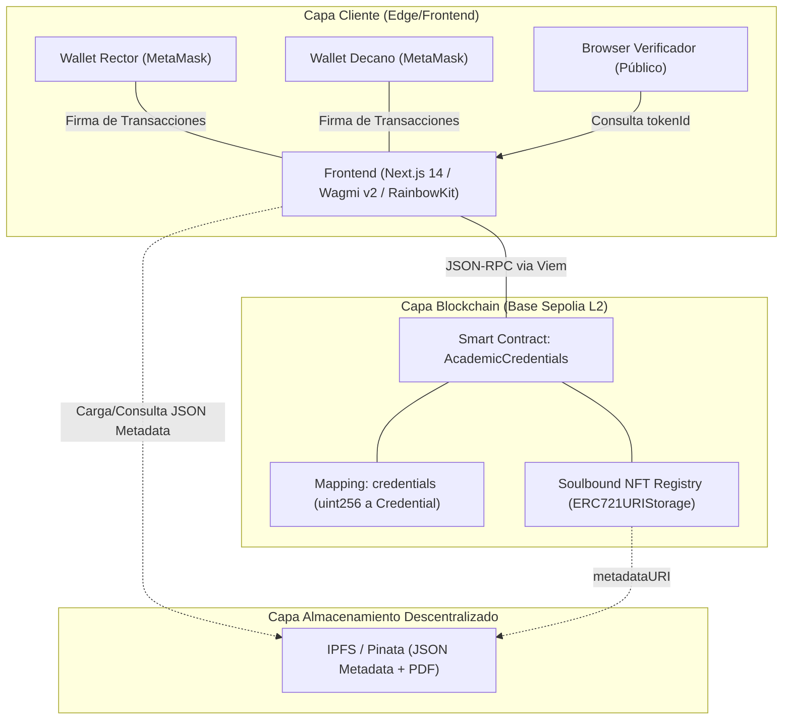
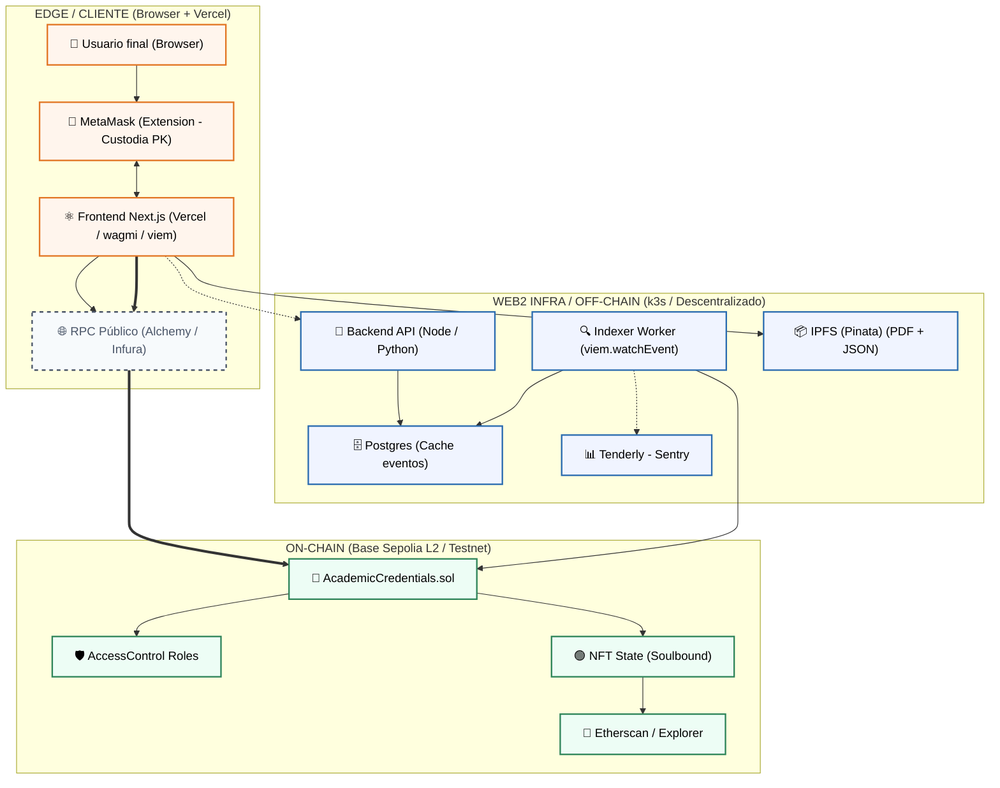
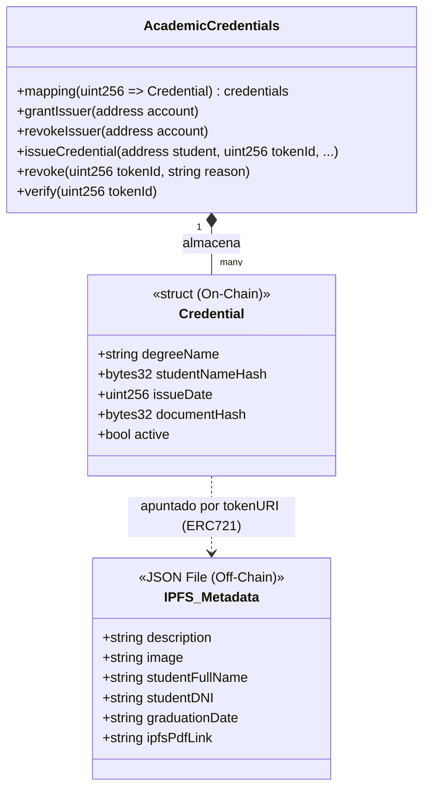
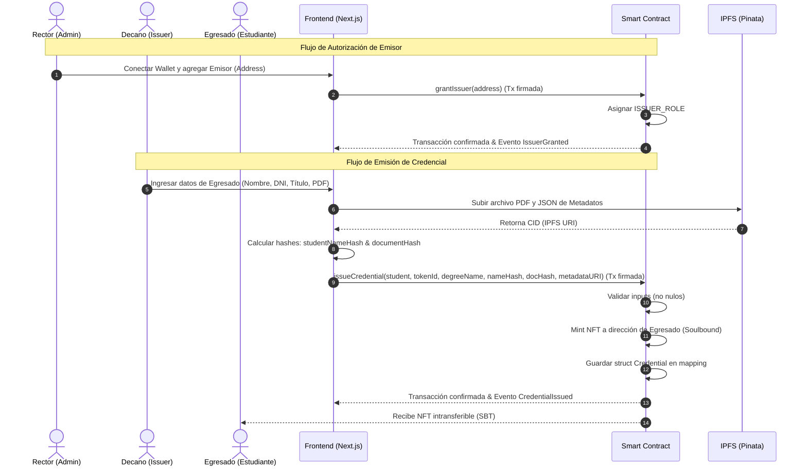
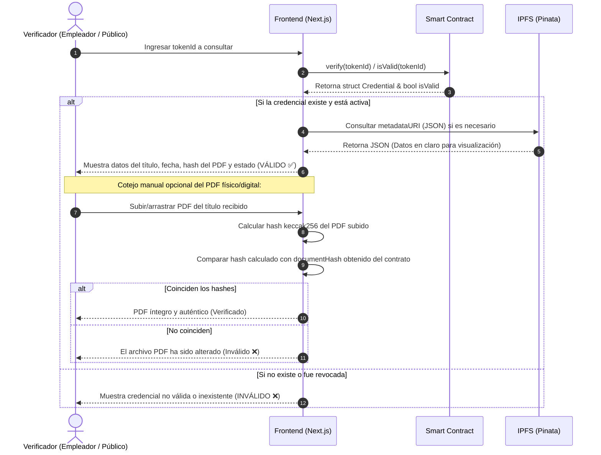

# Diagramas del Sistema de Credenciales Académicas

Este documento contiene los diagramas arquitectónicos y de flujo del sistema de credenciales académicas de la UNLu, modelados en lenguaje Mermaid y basados en la especificación del contrato [AcademicCredentials.sol](file:///home/tomas/workspace/diplomatura-blockchain/dApps/tp-final/unlu-cert-token/src/AcademicCredentials.sol) y los componentes de la interfaz de usuario en `frontend/`.

---

## 1. Diagrama de Componentes

Muestra la interconexión entre la interfaz de usuario (Frontend), las herramientas de firma (Wallets), el almacenamiento descentralizado (IPFS) y la infraestructura blockchain (Base Sepolia L2).

## Versión 2

---

## 2. Modelado de Datos (Struct `Credential`)

Define las propiedades del struct [Credential](file:///home/tomas/workspace/diplomatura-blockchain/dApps/tp-final/unlu-cert-token/src/AcademicCredentials.sol#L20-L26) persistidas on-chain en el smart contract, y su relación de referencia con los metadatos almacenados off-chain en IPFS.

---

## 3. Diagrama de Flujo de Emisión

Describe la secuencia de pasos de autorización inicial y la emisión de una credencial para un estudiante por parte del decano/emisor.

---

## 4. Diagrama de Flujo de Verificación Pública

Ilustra el proceso donde un tercero o empleador puede consultar de forma libre la validez y la integridad de la credencial y su PDF correspondiente.

