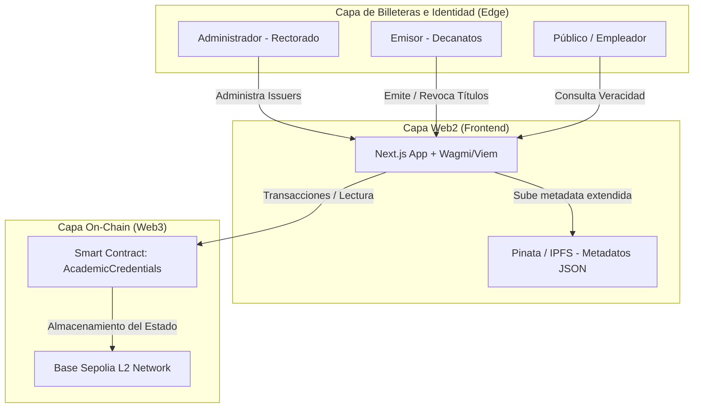
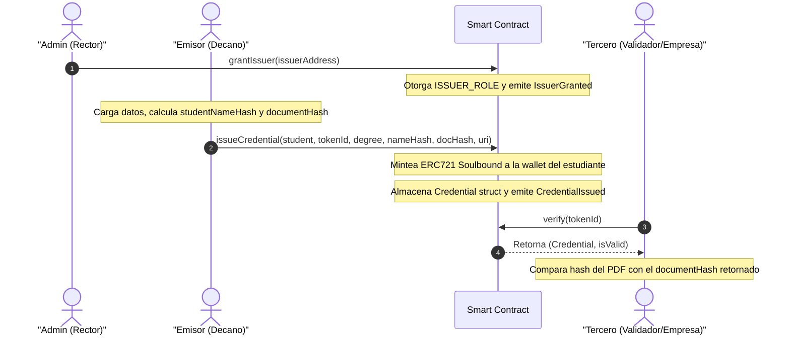

# Credenciales Académicas UNLu (Soulbound Tokens)

Este proyecto implementa un sistema descentralizado para la emisión y verificación de credenciales académicas (títulos universitarios) de la **Universidad Nacional de Luján (UNLu)** utilizando la tecnología blockchain. Las credenciales son representadas por tokens **Soulbound** (NFTs intransferibles) que quedan asociados permanentemente a la billetera digital del graduado.

---

## 🏛️ Parte 0: Contexto Institucional y Arquitectura

### 0.1 Hook UNLu — ¿Por qué este proyecto?

#### El problema real del fraude académico
En la actualidad, la falsificación de diplomas y certificados universitarios representa una seria amenaza para la integridad de los sistemas de educación y salud pública. Casos como la "Operación Alejo" (2023) en Argentina revelaron redes completas dedicadas a la falsificación de títulos universitarios y secundarios de medicina y docencia. Además, casos recurrentes de personas ejerciendo ilegalmente profesiones reguladas evidencian la ineficacia de los mecanismos de validación actuales.

#### Limitaciones de los sistemas tradicionales
- **Centralización (SIDCER)**: Aunque el Ministerio de Educación digitalizó los diplomas a través de SIDCER, el sistema depende de una infraestructura centralizada. Si el servidor central sufre un hackeo, alteración interna de la base de datos o caída del servicio, no existe una alternativa independiente para realizar la verificación.
- **Costos y Tiempos de Apostillado**: El trámite de apostillar un título argentino ante Cancillería para habilitar su uso internacional puede tardar entre 20 y 30 días hábiles y tiene costos económicos asociados significativos.
- **Burocracia y Dependencia**: El egresado depende permanentemente de los tiempos de respuesta de la universidad para emitir copias verificadas a empleadores o instituciones del extranjero.

#### Precedentes y Solución Blockchain
La **Universidad Nacional de Córdoba (UNC)** sentó un precedente en Argentina al implementar su Sistema de Validación Académica con smart contracts sobre blockchain (SIU Guaraní), reduciendo el tiempo de validación de 4 meses a solo 2 semanas, ganando reconocimiento internacional (Premio MetaRed TIC 2025). 

Nuestra dApp implementa esta tecnología para la **UNLu**, garantizando:
1. **Descentralización y Permanencia**: Los registros viven en una red pública global (Base Sepolia), inmunes a hackeos de servidores locales de la universidad.
2. **Privacidad (Commitment Scheme)**: En lugar de guardar datos sensibles on-chain, se almacena un hash del nombre del estudiante + DNI. Solo quien conoce el DNI y nombre puede validar la credencial.
3. **Verificación Instantánea**: Cualquier empleador o validador puede constatar la autenticidad en segundos interactuando directamente con el Smart Contract, sin intermediarios.

### 0.2 Modelado de Datos y Arquitectura del Sistema

#### 📐 Diagrama de Componentes (3 Capas)



#### 📄 Estructura de la Credencial y Compromiso de Privacidad

La blockchain es pública, por lo cual almacenar texto en claro viola normativas de protección de datos personales (GDPR, Ley 25.326 de Protección de Datos Personales en Argentina). Diseñamos la estructura del struct `Credential` para mitigar esto:

```solidity
struct Credential {
    string degreeName;       // Nombre del título obtenido (ej. "Licenciatura en Sistemas")
    bytes32 studentNameHash; // keccak256(Nombre Completo + DNI)
    uint256 issueDate;       // Timestamp de emisión del título
    bytes32 documentHash;    // keccak256 del PDF firmado del analítico/diploma original
    bool active;             // false si la credencial fue revocada
}
```

**Justificación de Decisiones de Diseño:**
1. **¿Por qué `studentNameHash` y no `nombreEstudiante` en texto claro?** Evita que cualquier observador del ledger público pueda realizar ingeniería social o scraping de datos filiatorios de los egresados. Funciona como un *commitment scheme*: solo un validador que ya posea el diploma físico o PDF (y por ende conozca el nombre y DNI) puede recrear el hash y verificar la coincidencia.
2. **¿Por qué `documentHash` separado de `metadataURI`?** La `metadataURI` apunta a IPFS, que si bien es descentralizado, depende de que el archivo sea "pinneado". Si los nodos que hospedan el archivo JSON se caen, el `documentHash` de la credencial queda guardado en la inmutable blockchain para siempre. Si la UNLu pierde el acceso al JSON, el egresado aún puede probar que su PDF físico es auténtico porque su hash (`documentHash`) coincide exactamente con el guardado on-chain.

#### 🔄 Diagrama de Flujo: Emisión y Verificación



---

## 📋 Características Técnicas

- **Soulbound (Intransferible)**: El título se ancla permanentemente a la dirección del estudiante. Las funciones de transferencia heredadas de ERC721 son anuladas a través del override de `_update`, arrojando el error `Soulbound: non-transferable`.
- **Control de Acceso basado en Roles (RBAC)**:
  - `DEFAULT_ADMIN_ROLE`: Asignado al rectorado para gestionar quiénes pueden emitir títulos (`grantIssuer` y `revokeIssuer`).
  - `ISSUER_ROLE`: Asignado a los decanos/oficina de alumnos autorizados para emitir (`issueCredential`) y revocar (`revoke`) títulos.

---

## 🚀 Guía de Desarrollo

### Requisitos
- [Foundry](https://book.getfoundry.sh/getting-started/installation)

### Instalación de Dependencias
```bash
cd unlu-cert-token
forge install openzeppelin/openzeppelin-contracts --no-commit
```

### Compilación y Ejecución de Pruebas
```bash
# Compilar los contratos
forge build

# Ejecutar la suite de tests (100% aprobados, >80% cobertura)
forge test -vv

# Reporte de cobertura
forge coverage
```

### Funciones del Contrato

El contrato expone las siguientes funciones obligatorias definidas por el enunciado original:

| Función | Rol Autorizado | Acción |
|---|---|---|
| `grantIssuer(address account)` | `DEFAULT_ADMIN_ROLE` | Otorga el rol de emisor a una cuenta y emite `IssuerGranted`. |
| `revokeIssuer(address account)` | `DEFAULT_ADMIN_ROLE` | Revoca el rol de emisor de una cuenta y emite `IssuerRevoked`. |
| `issueCredential(...)` | `ISSUER_ROLE` | Mintea el Soulbound NFT, guarda el struct `Credential` y emite `CredentialIssued`. |
| `revoke(uint256 tokenId, string reason)` | `ISSUER_ROLE` | Cambia el estado de la credencial a inactivo, quema el NFT y emite `CredentialRevoked`. |
| `verify(uint256 tokenId)` | Cualquiera (Público) | Devuelve los datos del struct `Credential` y un booleano indicando si la credencial es válida. |

---

Basado en la consigna original para la Diplomatura de Blockchain.
