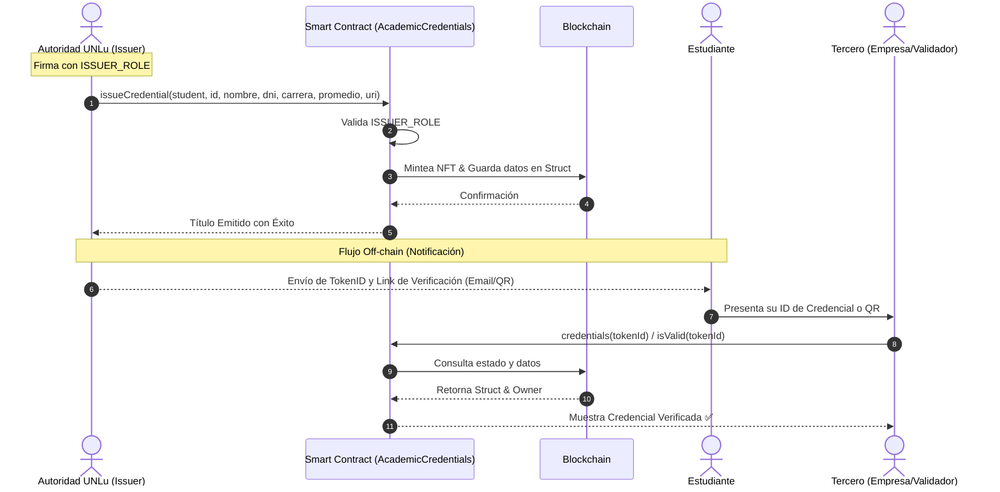

# UNLu Academic Credentials (Soulbound Tokens)

Este proyecto implementa un sistema de verificación de credenciales académicas para la Universidad Nacional de Luján (UNLu) utilizando la tecnología blockchain. Las credenciales se emiten como tokens **Soulbound** (NFTs intransferibles), lo que garantiza que el título pertenezca exclusivamente al estudiante y no pueda ser cedido ni comercializado.

## 📋 Características Principales
- **Intransferibilidad**: Los títulos están anclados a la billetera del estudiante (Soulbound).
- **Datos On-chain**: Almacena nombre, DNI, carrera, promedio y fecha de emisión directamente en la blockchain.
- **Metadatos Extendidos**: Soporta URIs (IPFS) para adjuntar el certificado analítico completo o PDF firmado.
- **Control de Acceso**: Utiliza `AccessControl` con un `ISSUER_ROLE` específico para las autoridades.

## 🛠 Arquitectura y Flujo

El sistema combina transacciones on-chain con un flujo de comunicación institucional:



---

## 🎓 Para el Estudiante

Una vez que la universidad emite el título:
1. **Recibe una notificación**: La UNLu le proporcionará un `TokenID` único.
2. **Verificación**: Podrá ingresar a la plataforma web del proyecto, colocar el `TokenID` y ver los datos del título (Nombre, Carrera, Promedio) validados directamente por la blockchain.
3. **Compartir**: Se podrá compartir ese ID o el código QR generado con cualquier empleador o institución para que verifiquen la autenticidad del título de forma instantánea.

---

## 🚀 Guía de Desarrollo

### Requisitos
- [Foundry](https://book.getfoundry.sh/getting-started/installation)

### Compilación y Tests
```bash
# Compilar contratos
forge build

# Ejecutar tests
forge test -vv
```

### Despliegue
Para desplegar el contrato y asignar automáticamente los roles de Administrador y Emisor al desplegador:
```bash
forge script script/Deploy.s.sol --rpc-url <YOUR_RPC_URL> --broadcast
```

---
Basado en el repositorio de [ejemplo](https://github.com/dpetrocelli/diplo-unq-blockchain-clase3)

